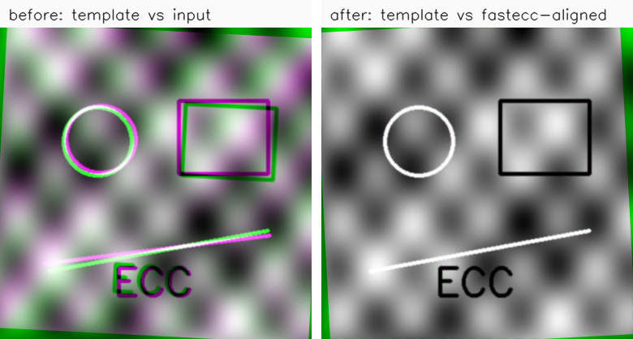

# fast-ecc

A research fork of OpenCV's `cv::findTransformECC` — the ECC image alignment of
**Evangelidis & Psarakis, PAMI 2008** — used to develop and measure improvements to
the algorithm's **speed** and **correctness**.

```cpp
// the signature mirrors cv::findTransformECC exactly
fastecc::findTransformECC(templ, input, W, cv::MOTION_AFFINE, criteria);
```

> Not affiliated with or endorsed by OpenCV. Derived from `modules/video/src/ecc.cpp`
> (BSD-3). See [NOTICE](NOTICE) and [LICENSE](LICENSE).



*Template in green, input in magenta — colour fringes mean misalignment. After
`fastecc::findTransformECC` (affine, ρ = 0.9997) the overlay collapses to grey.
Reproduce with `examples/align_pair.cpp`.*

## What this repository is for

Two kinds of work happen here, and they have different destinations.

**Speed.** Changes that make ECC compute the same answer in less time. These live here,
because they restructure the inner loop in ways that are more intrusive than OpenCV
would want in a single patch.

**Correctness.** Bugs found while measuring the above. These go **upstream** — they
belong in OpenCV, not in a fork. See [Upstream contributions](#upstream-contributions).

Each substantive change lands as its own commit with its own measurement, and the
[Results](#results) table below grows as they do. Nothing is claimed here that is not
measured, and every measurement states its operating point — motion type, window size
and thread count — because in this code the same change can be 1.5× or 1.0× depending
on all three.

## Status

Early, but the accuracy defect that made the old benchmark meaningless is fixed and
the numbers below are taken against a corrected OpenCV baseline.

| | state |
|---|---|
| Warp reduction (3 warps → 1 per iteration) | landed |
| Gaussian pre-filter border fix | landed ([opencv#29775](https://github.com/opencv/opencv/pull/29775) ported) |
| Accuracy test with a criterion that can fail | landed |
| Fused Gauss–Newton stage, all four motion types | landed |
| Row-invariant columns hoisted out of the inner loop | landed |
| Normalisation folded into the fused pass; mask solved for, not warped | landed |
| 5-tap image gradient (3 iterations to the floor instead of 4–5) | landed, on by default |
| Laplacian column (wider basin, 2.6× lower error on a real image) | landed, on by default |
| Equivalence test with a margin of real data, run under every flag set | landed |
| Coarse-to-fine pyramid (`nlevels`), like `findTransformECCMultiScale` | landed, default 3 levels |
| One parallel pass per iteration, exact bilinear sampling (no 1/32 px rounding) | landed |
| The whole stripe vectorised — sampler, derivatives, moments, Gauss–Newton kernels (OpenCV universal intrinsics; scalar loops below OpenCV 4.7) | landed |
| AVX2 + FMA build (`-DFAST_ECC_AVX2=ON`): eight lanes, gathers, fused multiply-adds | landed, off by default |

### What was wrong, and how it is guarded now

`findTransformECC` smooths the template with `GaussianBlur`, whose default
`BORDER_REFLECT_101` fabricates a ring `gaussFiltSize/2` px wide by mirroring the
interior. Used at full weight, that ring biases the estimated linear part toward a
smaller scale. This fork inherited the defect from `ecc.cpp` verbatim — it masked the
warped *input* border but never the template's fabricated ring.

It went unnoticed because the bundled test compared this fork only against a stock
OpenCV that had the same defect, with a 0.5 px tolerance on an error of 0.01–0.03 px.
Both are now fixed: the ring is dropped, and `test/test_equivalence.cpp` checks an
absolute threshold, agreement with cv, and — the part that actually catches this
class of bug — that **widening the pre-filter never makes the answer worse**. With the
fix reverted the suite reports sixteen failures and names the cause.

## Results

Every row states its operating point, because in this code the same change
measures 1.3x or 1.1x depending on it.

### Accuracy — equal to a fixed OpenCV with the plain kernels, better with the defaults

Measured against an OpenCV that carries the border fix, affine, window 200, 200
trials, started **at** the ground truth so that any movement is bias:

| | analytic scene | real image (fruits, resampled) | scale bias (t), analytic |
|---|---:|---:|---:|
| `cv::findTransformECC` (fixed) | 0.0017 px | 0.0072 px | +5.7e-07 (0.6) |
| `cv::findTransformECCMultiScale` (fixed, 4 levels) | — | 0.0078 px | — |
| `fastecc::findTransformECC`, `flags = FASTECC_LEGACY_PIPELINE` | 0.0017 px | 0.0072 px | +5.8e-07 (0.6) |
| `fastecc::findTransformECC` (defaults) | **0.0013 px** | **0.0025 px** | +2.2e-07 (0.2) |

(`findTransformECCMultiScale` has no analytic-scene entry: its 4-level pyramid takes a
200 px window to 25 px, and the band-limited scene has no content left there. It
carries the same border defect as `findTransformECC` — opencv#29781 — and is measured
here with that fix applied locally.)

Through the multi-pass pipeline with the plain kernels the two are statistically
indistinguishable and neither shows a systematic bias: the warp reduction, the fused stage
and the folded normalisation are the same algebra evaluated in a different order, and
convergence counts over 150 trials at five deformation steps match `cv` trial for trial.
Before the border fix this fork sat at 0.0287 px with a −1.8e−04 (t = −63.9) scale bias at
`gaussFiltSize=9`.

The defaults add two things. The [laplacian column](#two-optional-flags-the-laplacian-column-and-the-5-tap-gradient)
takes the bilinear interpolation error out of the fixed point: on the real image the corner
error drops 2.9×, and the fraction of trials that converge from the no-motion guess goes
from 69 / 26 / 4 % to 86 / 31 / 9 % at ×1 / ×2 / ×4 the default deformation (with the
default 3-level pyramid, 100 / 100 / 99 %). And the [single-pass iteration](#one-parallel-pass-per-iteration)
samples with exact bilinear weights where OpenCV's warp rounds the coordinate to 1/32 px:
the translation floor goes from 0.0176 to 0.0116 px, and the centre offset that the
rounding induced — affine biasX t = −12, euclidean −4.4 — is gone (t = −0.5 and −0.3).

### Speed

Cost of one iteration, affine, analytic scene, fixed 20 iterations, best of 3 runs,
default flags, single scale, against a border-fixed OpenCV:

| window | 4 threads | 2 threads | 1 thread |
|---:|---:|---:|---:|
| 256 | 8.9× | 6.6× | 5.2× |
| 512 | **11.3×** | 6.9× | 5.2× |
| 768 | 9.7× | 7.6× | **5.6×** |

(Homography at 512: 7.2× on one thread, 14.1× on four.)

With the AVX2 build (`-DFAST_ECC_AVX2=ON`: eight lanes and fused multiply-adds; the
binary then needs an AVX2 CPU):

| window | 4 threads | 2 threads | 1 thread |
|---:|---:|---:|---:|
| 256 | **17.3×** | 11.7× | 8.0× |
| 512 | 14.0× | 10.4× | 8.2× |
| 768 | 11.6× | 10.0× | 8.2× |

(Homography at 512: 11.9× on one thread, 24.9× on four.)

Five changes contribute, and they cover each other. The **warp reduction** takes the
three bilinear warps per iteration down to one. The **fused Gauss–Newton stage** builds
the Hessian and both projections in one pass without materialising the Jacobian, and the
saving grows with the parameter count. The **folded normalisation** removes the eleven
masked OpenCV calls and the mask warp that sat between the two, which were 45–60 % of an
iteration once the other two had landed. And the **single-pass iteration** turns what was
left — a warp, three filters, two reductions, each its own fork/join and each writing a
plane for the next — into one parallel region per iteration, which is where the
four-thread column comes from: single-thread cost is unchanged, two threads gain 1.2–1.3×
and four 1.6–2.1× over the multi-pass layout. And the **vectorised stripe** — the sampler,
the derivative and moment loops and the Gauss–Newton kernels, all in OpenCV's universal
intrinsics — takes 2.4–2.8× off the single-thread iteration and, being the whole stripe
rather than one stage competing with the thread pool, 1.9× off the four-thread one. The
AVX2 build (below) takes another 1.3–1.6× off the single-thread iteration and 1.1–1.9×
off the four-thread one.

The bundled `./build/bench` (512×512, best of 20 calls, the start 3 px and a few
percent off) shows the per-motion spread against both OpenCV implementations —
`findTransformECC` (ecc.cpp) and `findTransformECCMultiScale` (eccms.cpp, OpenCV ≥ 4.12,
with its default 4-level pyramid and single-scale):

| one thread | cv | eccms, 4 levels | fast, 1 level | fast, 3 levels (default) | fast 3 vs cv | fast 3 vs eccms | fast 1 vs eccms |
|---|---:|---:|---:|---:|---:|---:|---:|
| TRANSLATION | 42.2 ms | 10.4 ms | 7.3 ms | 9.1 ms | 4.7× | 1.14× | 1.41× |
| EUCLIDEAN | 66.1 ms | 12.4 ms | 12.2 ms | 10.8 ms | 6.1× | 1.14× | 1.01× |
| AFFINE | 82.6 ms | 15.9 ms | 16.7 ms | 10.6 ms | 7.8× | 1.50× | 0.95× |
| HOMOGRAPHY | 219.2 ms | 25.5 ms | 30.8 ms | 13.6 ms | **16.1×** | **1.87×** | 0.83× |

| two threads | cv | eccms, 4 levels | fast, 1 level | fast, 3 levels (default) | fast 3 vs cv | fast 3 vs eccms | fast 1 vs eccms |
|---|---:|---:|---:|---:|---:|---:|---:|
| TRANSLATION | 37.4 ms | 8.5 ms | 5.8 ms | 8.1 ms | 4.6× | 1.04× | 1.46× |
| EUCLIDEAN | 54.1 ms | 9.1 ms | 9.9 ms | 9.5 ms | 5.7× | 0.96× | 0.92× |
| AFFINE | 72.3 ms | 10.6 ms | 10.2 ms | 8.0 ms | 9.0× | 1.33× | 1.05× |
| HOMOGRAPHY | 186.0 ms | 15.5 ms | 18.8 ms | 8.9 ms | **21.0×** | **1.76×** | 0.82× |

| four threads | cv | eccms, 4 levels | fast, 1 level | fast, 3 levels (default) | fast 3 vs cv | fast 3 vs eccms | fast 1 vs eccms |
|---|---:|---:|---:|---:|---:|---:|---:|
| TRANSLATION | 32.5 ms | 7.5 ms | 4.8 ms | 8.2 ms | 4.0× | 0.92× | 1.57× |
| EUCLIDEAN | 50.5 ms | 7.5 ms | 7.2 ms | 7.9 ms | 6.4× | 0.95× | 1.05× |
| AFFINE | 64.7 ms | 9.7 ms | 6.7 ms | 6.8 ms | 9.5× | 1.41× | 1.44× |
| HOMOGRAPHY | 153.2 ms | 11.7 ms | 12.5 ms | 7.5 ms | **20.5×** | **1.56×** | 0.93× |

(Each ratio is taken within one run. Run `./build/bench 512 20 <threads> <eccmsLevels>
<fastLevels>` to reproduce. Corner errors in this bench: eccms 0.006–0.022 px, fast-ecc
0.0002–0.005.)

With `-DFAST_ECC_AVX2=ON`, fast-ecc's 3 levels against the same two (ms per call, then the
ratio to `findTransformECC` and to eccms with its 4 levels):

| AVX2 build | one thread | two threads | four threads |
|---|---:|---:|---:|
| TRANSLATION | 8.2 ms — 5.5×, 1.33× | 8.0 ms — 5.0×, 1.26× | 7.0 ms — 5.1×, 1.15× |
| EUCLIDEAN | 10.0 ms — 6.5×, 1.33× | 8.7 ms — 6.7×, 1.21× | 7.4 ms — 7.7×, 1.06× |
| AFFINE | 9.1 ms — 9.1×, 1.87× | 8.0 ms — 9.0×, 1.48× | 5.8 ms — 11.0×, 1.51× |
| HOMOGRAPHY | 10.1 ms — **24.7×**, **2.65×** | 7.4 ms — 27.2×, 2.21× | 6.6 ms — **29.2×**, 1.90× |

Against `findTransformECC`, homography gains most because the Jacobian path re-reads
its blocks P² times for the Gram matrix, and P = 8. The bench counts iterations to
convergence, so the 5-tap gradient (3 iterations to the floor instead of 4–5) is part
of these figures.

### Against `findTransformECCMultiScale`

OpenCV 4.12 added `cv::findTransformECCMultiScale`: a fresh implementation with a
4-level pyramid by default, 8-bit internally, a CV_64F warp and `parallel_for_` stripes.
Two things separate it from `findTransformECC`, and only one of them is the speed of the
implementation.

- **Single-scale, fast-ecc is well ahead.** With `nlevels = 1` on both, fast-ecc is
  2.1–3.5× faster than eccms on one thread, 1.7–2.7× on two and 1.6–2.9× on four
  (bench, 512²; eccms itself is 1.9–2.9× faster than ecc.cpp single-scale on one thread);
  with the AVX2 build 2.3–5.9× on one thread and 2.4–5.0× on four.
- **The pyramid is what made eccms faster** in this bench, whose start is 3 px and a few
  percent off so that the coarse levels take most of the iterations at 1/16 to 1/64 of
  the pixels: 2–3× against the scalar single-scale fast-ecc, and still 0.8–1.1× against
  the vectorised one. With its own pyramid ([below](#coarse-to-fine-nlevels)) and the
  vectorised stripe fast-ecc is ahead of eccms on affine and homography — 1.50× and
  1.87× on one thread, 1.41× and 1.56× on four — and level on translation and euclidean
  (0.92–1.14×; these 6–9 ms calls of three levels vary by ±15 % between runs on four
  threads), with an exact sampler where eccms's is fixed-point. The AVX2 build is ahead
  in every row: 1.33–2.65× on one thread, 1.21–2.21× on two, 1.06–1.90× on four.
- **On the real image the gap is wider.** At window 384 with the start 1–6 px off,
  fast-ecc with its default 3 levels takes 6.3–7.1 ms on one thread, 5.3–5.7 on two and
  4.3–4.6 on four, against 16.5–17.2 / 11.5–12.5 / 9.3–9.8 ms for eccms with four levels —
  2.0–2.7× faster (the AVX2 build 6.1–6.6 / 5.2–5.6 / 4.5–4.9 ms, 2.1–2.9×) — and its basin
  matches eccms's (99–100 % at ×4 the default deformation).
- **Accuracy on the real image:** eccms 0.0078 px, ecc.cpp 0.0072 px, fast-ecc 0.0025 px
  (affine, window 200, started at the truth); the pyramid does not change the floor.

The fused kernels are generated by [`tools/gen_gn_kernels.py`](tools/gen_gn_kernels.py);
CI fails if `src/gn_fused.inc` stops matching its output.

Measured on an Intel Core i7-8700K (6C/12T), Windows 11, MSVC, Release, against
OpenCV 4.15.0-dev built with the border fix applied.

## Reports

The measurements behind each change, in more depth than the table above, are in
[`docs/reports/`](docs/reports/index.html):

- **Reducing the warps per iteration** — how three warps become one, and why it is
  allowed
- **The warp reduction against the border fix** — why the speed-up decays at large
  windows with a thread pool, and the `gaussFiltSize` re-tuning
- **Fusing the Gauss–Newton stage** — why all four motion types are the same
  face-splitting product, and why the saving grows with the parameter count
- **After the fusion** — the 5-tap gradient (the first-order model's one estimated
  quantity), the folded normalisation, the sigma experiment and the laplacian column it
  left behind

## Why the warp reduction is faster

OpenCV's ECC warps **three** images every iteration: the input image **and** its two
gradient images `∂I/∂x`, `∂I/∂y` (plus a cheap nearest-neighbour mask warp).
`warpAffine`/`warpPerspective` with bilinear interpolation is the dominant cost of the
inner loop.

This version warps **only the image**, then obtains the gradients from the *warped*
image with a `filter2D`; the `A⁻ᵀ` recombination is applied per pixel inside the fused
Gauss–Newton pass. So the two bilinear gradient warps per iteration disappear.

| | image warp | gradient warps | mask warp |
|---|:---:|:---:|:---:|
| `cv::findTransformECC` | 1 | 2 | 1 |
| `fastecc::findTransformECC` | 1 | **0** (filter2D) | **0** (solved for; 1 with a user mask) |

The gain from *this* change is **not** uniform. It is largest at small windows and on a
single thread, and falls to break-even at large windows with a thread pool — because
OpenCV parallelises `warpAffine` above roughly 384 px but not the
`filter2D` that replaces it. That region is covered by the fused
Gauss–Newton stage instead. Any speed figure quoted without a window size and a thread
count is meaningless.

### The math

ECC maximizes the normalized correlation between the template and the warped input
`I(W(x; p))`. The Gauss–Newton step needs the **steepest-descent images**, i.e. the
image gradient evaluated at the warped location. The key identity is the chain rule: for
a warp with linear part `A`,

```
∂/∂x [ I(W(x; p)) ] = Aᵀ · (∇I)(W(x; p))
```

So the finite-difference gradient of the **already-warped** image is the image-domain
gradient pre-multiplied by `Aᵀ`. Multiplying it by `A⁻ᵀ` (`recombination`, applied per pixel
inside the fused pass) undoes
that frame change and recovers the quantity the Jacobian assembly expects, **without
warping the gradient images separately**.

For euclidean the linear part is orthonormal, so `A⁻ᵀ = A` and the recombination is a
rotation of the gradient vectors; for affine it is the exact inverse frame change. For
homography it remains an approximation: a projective warp's Jacobian varies per pixel
and only its linear part is used.

Note that the recombination coefficient does **not** change the Gauss–Newton fixed
point — it is an invertible reparameterisation, so `Jᵀr = 0` is the same condition
either way. Correcting it from `A` to `A⁻ᵀ` was a correctness cleanup, not a measurable
accuracy improvement.

### The normalisation is folded into the fused pass

Everything between the `filter2D` and the fused Gauss–Newton pass used to be a chain of
masked OpenCV calls that each wrote a plane: three masked `setTo`, two `meanStdDev`,
two masked `subtract`, two `countNonZero`, a dot product and the two `addWeighted` of
the recombination. Profiling one iteration showed that chain, together with the mask
warp, at 45–60 % of the time on a single thread (window 200) — more than the warp and
the Gauss–Newton stage combined for translation.

It is now two passes that write nothing. `maskedStats` collects the six masked moments
(N, ΣI, ΣI², ΣT, ΣT², ΣIT) in one sweep; the means, both norms and the correlation of the
centred vectors are algebra on those. The fused kernels then read the *raw* planes and
do the masking (a masked pixel is skipped), the `A⁻ᵀ` recombination and the zero-mean
centring per pixel. The arithmetic is the same, only the summation order differs: the
fixed point agrees with the previous layout to four digits in all four motion types.

The mask warp goes the same way when there is no user mask. `preMask` is then a
rectangle, and its nearest-neighbour warp is the set of template pixels whose rounded
warped coordinate lands in it — along a row an interval, for affine and (with a
positive denominator) projective warps alike. `analyticMask` solves for that interval
per row instead of resampling; against the warped mask it differs on 0–2 pixels per
warp (the 1/1024 fixed-point ties of OpenCV's rounding), and the fixed point does not
move. A user-supplied mask still takes the warp.

Per iteration against the previous layout, best of three interleaved runs:

| motion | 200 px, 1 thread | | 512 px, 1 thread | 200 px, 4 threads |
|---|---:|---:|---:|---:|
| translation | 0.605 → 0.387 ms | 1.56× | | |
| euclidean | 0.678 → 0.481 ms | 1.41× | | |
| affine | 0.829 → 0.590 ms | 1.40× | 1.47× | 1.49× |
| homography | 1.707 → 1.278 ms | 1.34× | 1.35× | 1.88× |

(Of that, folding the normalisation alone is 1.26× / 1.21× / 1.17× / 1.12×; the rest
is the mask.)

### Two optional flags: the laplacian column and the 5-tap gradient

`findTransformECC` takes a trailing `flags` argument; both flags are on by default (`FASTECC_DEFAULT_FLAGS`), pass 0 for the plain kernels.

**`FASTECC_LAPLACIAN_COLUMN`** carries the laplacian of the warped image, scaled by the
pre-filter's sigma, as one more Gauss–Newton column. The coefficient it estimates is
discarded; the column is a *nuisance direction*. It came out of asking whether sigma
itself could be estimated alongside the motion (it cannot — the correlation coefficient
has no maximum in sigma while the images are misaligned, so a joint estimate runs sigma
up), but the column that estimate would use turns out to have the shape of two things
the first-order model leaves in the residual: the isotropic second-order term of a
misalignment, and the error of bilinear interpolation. With it in the system the first
step from a 1 px offset lands at 0.07 px instead of 0.18, the basin widens, and on a
real image the fixed point moves toward the truth. It costs one 3×3 filter and a
larger fused pass (affine 20 → 27 live accumulators).

**`FASTECC_GRAD5`** uses the 4th-order 5-tap finite difference `(1, −8, 0, 8, −1)/12`
for the image gradient instead of the 3-tap. The forward-additive step is the exact
maximiser of the paper's first-order model, so the gradient estimate is the only thing in
that model that is not exact, and its bias sets the convergence rate: the error contracts
by ~0.06 per iteration instead of ~0.17. The fixed point is unchanged and the cost is nil.

Measured against the plain kernels (window 200, one thread, 100 trials; `eval`):

| | plain | column | 5-tap | both |
|---|---:|---:|---:|---:|
| affine, error after 1 / 3 iterations from 1 px | 0.183 / 0.0049 | 0.074 / 0.0033 | 0.078 / 0.0017 | **0.030 / 0.0016** |
| affine floor, analytic scene | 0.0016 | 0.0014 | 0.0017 | 0.0014 |
| affine floor, real image (fruits) | 0.0073 | **0.0027** | 0.0070 | **0.0028** |
| homography floor, real image | 0.0129 | 0.0062 | 0.0123 | 0.0061 |
| affine floor, 5 grey levels of noise | 0.0216 | 0.0214 | 0.0208 | 0.0208 |
| basin ×1 / ×2, affine | 76 / 23 % | 86 / 30 % | 77 / 26 % | 86 / 31 % |
| basin ×1 / ×2, homography | 62 / 21 % | 80 / 29 % | 66 / 21 % | 80 / 28 % |
| ms per iteration, affine / homography | 0.580 / 1.218 | 0.644 / 1.243 | 0.584 / 1.235 | 0.647 / 1.243 |
| ms per call (|Δρ| < 1e-6), affine / homography | 4.27 / 7.84 | 4.44 / 7.94 | 3.38 / 6.41 | **3.42 / 6.38** |

The column pays for its 2–19 % per iteration with one iteration fewer, so on its own it
is time-neutral and buys accuracy and basin; with the 5-tap the call is 1.25× faster
*and* the most accurate of the four. For pure translation the column costs more time than
it saves (the plain kernel is already at its floor in 3 iterations) while still widening
the basin from 82 to 98 % at ×1.

A third flag, **`FASTECC_LEGACY_PIPELINE`**, forces the multi-pass iteration described in
the sections above (OpenCV's warp, full-size gradient planes, separate moment and
Gauss–Newton passes) instead of the [single pass](#one-parallel-pass-per-iteration). It is
what a user mask, or a projective warp whose denominator changes sign over the template,
takes anyway; it is kept for comparison, and it reproduces the previous fixed points.

### One parallel pass per iteration

After the folded normalisation an iteration was still five things in a row — OpenCV's
warp, two gradient filters and a laplacian, the moment pass, the Gauss–Newton pass — each
a fork/join, each writing a full-size plane for the next. It is now one parallel region
over stripes of rows. Each stripe samples its rows of the warped image straight from the
blurred input (with a halo for the derivative stencils), takes the gradients and the
laplacian in the stripe, solves for its mask rows, and accumulates the masked moments and
the Gauss–Newton sums; nothing full-size is written. The planes are centred on the
previous iteration's means, since the current ones are not known until the pass is over,
and the projections are corrected exactly afterwards with the column sums of the Jacobian,
which the generated kernels accumulate for that purpose. Stripes are four per thread: with
one per thread a worker that wakes late stalls the whole region, and two threads were no
faster than one.

Per iteration, affine, multi-pass → single-pass, best of 3 interleaved runs:

| window | 1 thread | 2 threads | 4 threads |
|---:|---:|---:|---:|
| 200 | 0.693 → 0.684 ms | 0.609 → 0.462 ms (1.32×) | 0.566 → 0.277 ms (**2.05×**) |
| 512 | 4.608 → 4.704 ms | 3.590 → 3.042 ms (1.18×) | 2.933 → 1.832 ms (**1.60×**) |
| 512, homography | 9.28 → 8.91 ms | 5.92 → 5.89 ms | 4.31 → 3.45 ms (1.25×) |

The sampler uses exact bilinear weights, where OpenCV's warp rounds the sampling
coordinate to 1/32 px (see [exact-warp](#not-bit-identical-to-opencv)). That is why the
translation floor and the centre biases in the accuracy table move: they were the rounding.
One consequence to know about: an input that was itself produced by OpenCV's rounding warp
can be matched *exactly* by the rounding warp and not by an exact one, so on such an input
the multi-pass path sits below the true floor for pure translation (0.0010 px on the
resampled fruits) and the single pass at it (0.0125, where eccms also sits, 0.0129). On
the analytic scene, whose ground truth is not resampled, the single pass is the more
accurate one in every motion type.

### The stripe in vectors

Everything the stripe does is vectorised with OpenCV's universal intrinsics in their
function form, which needs OpenCV ≥ 4.7; an older OpenCV, or `-DFASTECC_NO_SIMD`, gets
the scalar loops, and CI runs the equivalence test on both.

- **The sampler** makes two passes per row over chunks of 64 pixels: the coordinates,
  truncated and split into tap index and fractions, are streamed into small buffers
  first, then gathered and combined as a weighted sum of the four taps, so that nothing
  but the gathers and the weighting is on the second pass's dependency chain. An
  external build sees only SSE2 (or NEON) through OpenCV's headers — the AVX2 gathers
  need OpenCV's in-tree dispatch — so a tap vector is four scalar loads and three
  shuffles, and the pass is bound by the load ports at about 4 cycles per pixel where
  the taps stay in L1; a rotation spreads them over rows and costs another 50 %.
- **The derivatives, the laplacian and the moments** are one vector loop over the mask
  interval.
- **The Gauss–Newton kernels** get a vector path from the generator: one partial sum per
  lane for every live accumulator, the mask applied as a bitwise AND on the gradient
  inputs (everything downstream of a zeroed gradient is zero, so a masked lane
  contributes nothing), and the lanes reduced into the scalar row accumulators before
  the scalar tail. MSVC does not vectorise these reductions on its own under
  `/fp:precise`; the lanes are the reassociation the kernels already make — float
  within a row, double at row end — one level down, and four shorter chains lose less
  than one long one.
- **Four stripes per thread, on one thread too**: a stripe's planes then stay in L2
  between the sampler, the derivative loop and the kernel, and the kernel pass shrinks
  by up to a third.
- **Eight lanes, on request.** Outside OpenCV's own build its headers enable SSE2 alone,
  whatever the compiler was given, so the default build's vectors are four floats wide
  with separate multiplies and adds — and the kernel's inner loop is then issue-bound:
  181 instructions per four pixels, 76 of them floating-point, 56 of them spills of the
  lane accumulators over 16 registers. `-DFAST_ECC_AVX2=ON` compiles with `/arch:AVX2`
  (or `-mavx2 -mfma`) and defines the feature macros OpenCV's own dispatch would
  (`CV_AVX2`, `CV_FMA3`, …) ahead of its headers, so the same source — written
  width-agnostically, `vx_load` and `vlanes()` — runs at eight lanes with fused
  multiply-adds and hardware gathers. The binary then needs an AVX2 CPU (2013 on).

The vector lanes and the scalar tails share their arithmetic, so a row does not depend
on where the vector part ends, and the fixed points are unchanged to four digits. The
single-pass stage profile (`eval/spbench.cpp`, one thread, window 512, ms per iteration,
scalar → default build → AVX2 build, same run):

| motion | sampler | derivatives + moments | Gauss–Newton | iteration |
|---|---:|---:|---:|---:|
| translation | 1.25 → 0.53 → 0.36 | 0.96 → 0.47 → 0.36 | 1.02 → 0.38 → 0.21 | 3.15 → 1.38 → 0.86 (**2.3× → 3.7×**) |
| euclidean | 1.60 → 0.67 → 0.70 | 1.00 → 0.42 → 0.44 | 1.95 → 0.63 → 0.37 | 4.39 → 1.81 → 1.27 (**2.4× → 3.5×**) |
| affine | 1.44 → 0.70 → 0.55 | 0.95 → 0.46 → 0.38 | 2.37 → 0.79 → 0.38 | 5.12 → 1.93 → 1.36 (**2.7× → 3.8×**) |
| homography | 3.18 → 1.24 → 0.83 | 1.00 → 0.47 → 0.41 | 5.06 → 1.49 → 0.77 | 8.92 → 3.14 → 2.06 (**2.8× → 4.3×**) |

Unlike a vectorised kernel on its own, which competed with the thread pool for the
same headroom (1.04–1.14× at four threads in an earlier experiment), the whole stripe
in vectors keeps its gain with threads: per iteration at window 512, 2.06× on one
thread and 1.92× on four.

### Coarse to fine: `nlevels`

`findTransformECC` takes a trailing `nlevels` (default 3; 1 is single scale). Above 1 it
runs coarse to fine over a `pyrDown` pyramid the way `findTransformECCMultiScale` does:
each level runs the whole single-scale iteration — pre-filter, border ring, mask, flags,
stop criterion — on the downsampled images and hands its warp to the next finer level
(translation ×2, projective row ÷2). The coarsest level keeps at least 16 px on the
template's shorter side, and a coarse level that gives up (a band-limited scene with
nothing left at that scale) is skipped rather than fatal; on the analytic test scene at
200 px, 3 levels lose no trial and 4 lose 4 %. The finest level is the same iteration as
before, so the floor is unchanged; what the pyramid buys is the start:

| fruits, affine, window 384, one thread, ms per call (corner error) | start 1 px off | 3 px | 6 px |
|---|---:|---:|---:|
| `cv::findTransformECC` | 33.5 (0.0030) | 34.9 | 50.9 |
| `cv::findTransformECCMultiScale`, 4 levels | 16.9 (0.0032) | 17.2 | 16.5 |
| `fastecc::findTransformECC`, 1 level | **6.3 (0.0014)** | 7.6 | 10.5 |
| `fastecc::findTransformECC`, 3 levels (default) | 7.0 (0.0014) | **6.3** | **7.1** |

On two and four threads the default takes 5.3–5.7 and 4.3–4.6 ms whatever the start,
against 11.5–12.5 and 9.3–9.8 for eccms. On the real image the fraction of trials that converge from
the no-motion guess at ×4 the default deformation goes from 85 % (1 level) to 99–100 %
(3–4 levels), which is where eccms sits; for homography from 62 % to 96 %.

### Not bit-identical to OpenCV

This method takes gradients **of the warped image**, whereas OpenCV warps gradients **of
the original image**. Bilinear resampling and finite differencing do not commute for
affine and projective warps, so the result is **not bit-identical** to
`cv::findTransformECC`. (For pure translation the two paths are exactly equivalent as
operators; any difference there is floating-point summation order and border handling,
not non-commutation.)

Which of the two is closer to ground truth is **not settled** and is not currently
claimed either way. Measuring it requires a fixed OpenCV baseline and many random
sub-pixel phases — a single alignment cannot distinguish the two.

## Quick start

```bash
git clone https://github.com/yosh-shimizu/fast-ecc.git
cd fast-ecc
cmake -S . -B build -DCMAKE_BUILD_TYPE=Release
cmake --build build -j
ctest --test-dir build --output-on-failure   # accuracy vs ground truth
./build/bench                                 # timing table
./build/align_pair template.png input.png aligned.png affine
```

Requires OpenCV `core`, `imgproc` and `video` (plus `imgcodecs` for the example) — any
4.x.  On Debian/Ubuntu: `sudo apt-get install libopencv-dev`.

Add `-DFAST_ECC_AVX2=ON` to the configure line for the AVX2 + FMA build: eight-lane
vectors, about 1.5× faster per iteration, and the binary then needs an AVX2 CPU. If you
compile `src/fast_ecc.cpp` yourself, that is `-DFASTECC_AVX2=1` together with `/arch:AVX2`
or `-mavx2 -mfma`. Below OpenCV 4.7 the vector paths fall back to scalar loops either way.

### Use it in your project

The library is a single `.cpp` + header. Either add this repo via CMake
`add_subdirectory(fast-ecc)` and link `fast_ecc`, or drop `include/fast_ecc.hpp` and
`src/fast_ecc.cpp` into your build.

```cpp
#include <fast_ecc.hpp>

cv::Mat W = cv::Mat::eye(2, 3, CV_32F);
double rho = fastecc::findTransformECC(
    templateGray, inputGray, W, cv::MOTION_AFFINE,
    cv::TermCriteria(cv::TermCriteria::COUNT + cv::TermCriteria::EPS, 50, 1e-4));
```

The signature mirrors `cv::findTransformECC` exactly (same arguments, same defaults,
same `MOTION_*` types, same `warpMatrix` conventions).

## Upstream contributions

Correctness work found here is reported to OpenCV rather than kept as a fork advantage.

| | |
|---|---|
| [opencv#29774](https://github.com/opencv/opencv/issues/29774) | `findTransformECC` systematically under-estimates scale (the border defect above) |
| [opencv#29775](https://github.com/opencv/opencv/pull/29775) | the fix for it |
| [opencv#29776](https://github.com/opencv/opencv/issues/29776) | the ECC accuracy test averages warp-matrix entries of different units, so it cannot detect regressions |
| [opencv#29781](https://github.com/opencv/opencv/issues/29781) | `findTransformECCMultiScale` has the same border defect |
| [opencv_extra#1405](https://github.com/opencv/opencv_extra/pull/1405) | performance baseline update |

## Scope & limitations

- Inputs are single-channel `CV_8UC1` or `CV_32FC1`, like OpenCV.
- The speed-up is largest where warps dominate the inner loop. If you add heavy
  per-iteration work on top (robust losses, extra parameters), the relative gain shrinks.
- For homography the gradient recombination is an approximation (only the linear part of
  the per-pixel projective Jacobian is used). If you need bit-exact agreement with
  OpenCV for any motion type, prefer the stock function.
- Higher-order interpolation (`INTER_CUBIC` / `INTER_LANCZOS4`) in the warp does **not**
  improve registration accuracy in our measurements (corner RMS moves by less than the
  Monte-Carlo noise, and the iteration count is unchanged) while costing 1.4–2.6× per
  iteration — so, like OpenCV, this code stays on bilinear.
- Pairs well with a coarse-to-fine pyramid (align low-res first) to cut warped pixels.

## Citation

```bibtex
@article{evangelidis2008ecc,
  author  = {Evangelidis, Georgios D. and Psarakis, Emmanouil Z.},
  title   = {Parametric Image Alignment Using Enhanced Correlation Coefficient Maximization},
  journal = {IEEE Transactions on Pattern Analysis and Machine Intelligence},
  volume  = {30}, number = {10}, pages = {1858--1865}, year = {2008}
}
```

## License

BSD-3-Clause. Derived from OpenCV `ecc.cpp` (Copyright © 2000 Intel Corporation);
modifications © 2026 [yosh-shimizu](https://github.com/yosh-shimizu). See [LICENSE](LICENSE) and [NOTICE](NOTICE).
